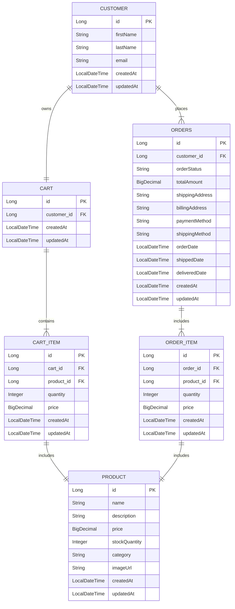

# Enoca Java Challenge

Bu proje, Spring Boot kullanılarak geliştirilmiş bir e-ticaret backend hizmetidir. Müşteriler, ürünler, alışveriş sepetleri, siparişleri yönetmek için REST API sunar.

---

## Database Structure




## Endpoint'ler

### Müşteriler
- **Tüm Müşterileri Getir**: `GET /customers`
- **Müşteri Ekle**: `POST /customers`
- **Müşteri ID ile Getir**: `GET /customers/{id}`
- **Müşteri Güncelle**: `PUT /customers/{id}`
- **Müşteri Sil**: `DELETE /customers/{id}`

### Ürünler
- **Tüm Ürünleri Getir**: `GET /products`
- **Tekil Ürünü Getir**: `GET /products/{id}`
- **Ürün Oluştur**: `POST /products`
- **Ürünü Düzenle**: `PUT /products/{id}`
- **Ürünü Sil**: `DELETE /products/{id}`

### Sepetler
- **Sepeti Müşteriye Ata**: `POST /carts`
- **Kullanıcının Sepetini Getir**: `GET /carts/customer/{customerId}`
- **Sepete Ürün Ekle**: `POST /cart-items`
- **Sepetteki Ürünü Düzenle**: `PUT /cart-items/{id}`
- **Sepetten Ürünü Çıkar**: `DELETE /cart-items/{id}`
- **Sepeti Boşalt**: `POST /carts/empty/{customerId}`

### Siparişler
- **Sipariş Ver**: `POST /orders/place-order`
- **Tüm Siparişleri Getir**: `GET /orders`
- **Sipariş Detaylarını Getir**: `GET /orders/{id}`
- **Müşteriye Göre Siparişleri Getir**: `GET /orders/customer/{customerId}`

---

## Kullanılan Teknolojiler ve Paketler

### Spring Boot Bağımlılıkları
1. **Spring Boot Starter Web**: RESTful web servisleri oluşturmak için.
2. **Spring Boot Starter Data JPA**: Veritabanı işlemlerini yönetmek için.
3. **Spring Boot Starter Validation**: DTO giriş doğrulaması için.
4. **H2 Database**: Mock bir API geliştirdiğimizden dolayı, In-memory veritabanı kullanmayı tercih ettim.
5. **Lombok**: Model sınıflarındaki  boilerplate kodu azaltmak için.
6. **MapStruct**: DTO'dan entity'ye verimli bir şekilde eşleme yapmak için.

### Build Aracı
- **Maven**: Bağımlılıkları yönetmek ve projeyi derlemek için kullandım.

---

## Dizin Yapısı

```plaintext
./
├── src
│   ├── main
│   │   └── java
│   │       └── com
│   │           └── enoca
│   │               └── ecommerce
│   │                   ├── controllers    # RESTful API controlle'leri
│   │                   ├── dtos           # Veri Transfer Nesneleri
│   │                   ├── entities       # JPA Entity tanımları
│   │                   ├── exceptions     # Hataları handle etmek için
│   │                   ├── mappers        # DTO-Entity eşleme için MapStruct
│   │                   ├── repositories   # Spring Data JPA repoları
│   │                   ├── services       # Business logic katmanı
│   │                   └── ECommerceBackendApplication.java # Ana giriş noktası
│ 
└── pom.xml                      # Maven yapılandırma dosyası
```

---

## Projeyi Çalıştırmak

Projeyi her ortamda rahat bir şekilde çalıştırabilmek için Docker ile container haline getirdim.
- Proje ana dizinindeyken `docker compose up --build` yazarak hızlı bir şekilde başlatılabilir.

---

## Postman ile Endpointleri Test Etmek

API endpointlerini Postman ile test etmek için [docs/enoca-endpoints.json](https://github.com/ardaaltinors/enoca-task/blob/master/docs/enoca-endpoints.json) içerisinde bulunan dosyayı Postman'e import edebilirsiniz.